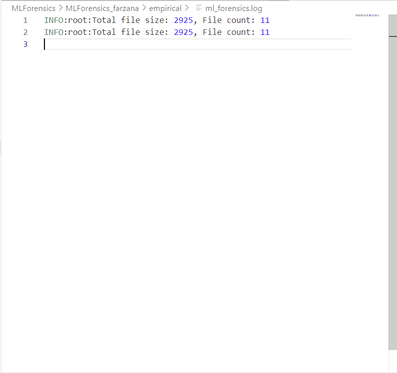

# COMP 5710/6710 Final Project
## Team: Agile Avengers

### Part A
Create a Git Hook that will run and report all security weaknesses in the project in a CSV file whenever a Python file is changed and committed. (20%)

    - Went to .git/hooks/ in the repository
    - Ran cp pre-commit.sample pre-commit
    - Opened pre-commit
    - Edited pre-commit to run bandit and add found security weaknesses to a csv file
    
Code Changed in pre-commit file: 

Terminal Output after committing a change:

CSV file created:

#### Lessons Learned:
Learned how to build a Git Hook to help automatically identify security weaknesses. Also learned about the tools that can be used to identify security weaknesses. Specifically, we are using the tool, Bandit, to identify security weaknesses since the given file contains Python scripts.

### Part B
Create a fuzz.py file that will automatically fuzz 5 Python methods of your choice. Report any bugs you discovered by the fuzz.py file. fuzz.py will be automatically executed from GitHub actions. (20%)

#### Errors:

##### 1. Renamed directories to resolve import errors in fuzz.py
##### 2. (env) jzm0223@LAPTOP-DLT719A3:/mnt/c/Users/mdjf7/AGILEAVENGERS-SPRING2024-SQA$ python fuzz.py
##### Traceback (most recent call last):
##### File "/mnt/c/Users/mdjf7/AGILEAVENGERS-SPRING2024-SQA/fuzz.py", line 6, in <module>
##### from MLForensics.MLForensics_farzana.FAME_ML.py_parser import getPythonAtrributeFuncs, getFunctionAssignments
##### File "/mnt/c/Users/mdjf7/AGILEAVENGERS-SPRING2024-SQA/MLForensics/MLForensics_farzana/FAME_ML/py_parser.py", line 10, in <module>
##### import constants
##### ModuleNotFoundError: No module named 'constants'
##### The error message indicates that the constants module is not found. Resolved this using PYTHONPATH

#### Choice of Python Methods:

##### getDataLoadCount method in lint_engine.py:

###### This method performs pattern matching to identify data loading operations in the Python code.
###### It relies on various conditions and checks to detect specific data loading patterns.
###### The method could potentially miss some data loading patterns or incorrectly identify them due to the complexity of the conditions.

##### getModelLoadCounta method in lint_engine.py:

###### This method is responsible for detecting model loading operations in the Python code.
###### It uses pattern matching and conditions to identify specific model loading patterns.
###### Similar to getDataLoadCount, this method could have potential bugs or miss certain model loading patterns.

##### getDataPipelineCount method in lint_engine.py:

###### This method aims to identify data pipeline operations in the Python code.
###### It relies on pattern matching and conditions to detect specific data pipeline patterns.
###### The method could potentially have bugs or miss certain data pipeline patterns due to the complexity of the conditions.

##### getPythonAtrributeFuncs method in py_parser.py:

###### This method is critical as it is used to detect functions with specific attribute patterns in the Python code.
###### It involves traversing the Abstract Syntax Tree (AST) and identifying function calls with specific attribute patterns.
###### The method could have potential bugs or miss certain attribute function patterns due to the complexity of the AST traversal and conditions.

##### getFunctionAssignments method in py_parser.py:

###### This method is responsible for identifying function assignments in the Python code.
###### It involves traversing the AST and detecting function calls assigned to variables.
###### The method could potentially have bugs or miss certain function assignment patterns due to the complexity of the AST traversal and conditions.

##### These methods are critical because they involve pattern matching, AST traversal, and complex conditions to identify specific code patterns. They could potentially contain bugs if the conditions are not comprehensive enough or if there are edge cases that are not handled correctly.

#### Activities Performed:

##### Fuzz Test Script Creation:
Developed a fuzz.py script that uses the Hypothesis library to generate test cases dynamically.
Selected critical methods from the project (getDataLoadCount, getModelLoadCounta, getDataPipelineCount, getPythonAttributeFuncs, and getFunctionAssignments) for fuzzing.
##### Writing Test Functions:
Implemented test functions using the @given decorator from Hypothesis to supply random inputs to the selected methods.
Configured the test cases to handle exceptions and log results to a file, ensuring any failures are recorded for analysis.
##### Integration with GitHub Actions:
Set up a CI/CD pipeline using GitHub Actions to automate the execution of fuzz tests upon each push or pull request to the feature/fuzzing branch.
Configured the workflow to install necessary dependencies, set the appropriate environment variables, and run the fuzz.py script.
##### Logging and Result Analysis:
Enhanced the fuzz testing script to log results into fuzz_report.txt for successful tests and detailed error outputs in case of failures.
Utilized Python's built-in logging module to provide detailed debug information during test execution.
##### Dependency Management:
Created a requirements.txt file to manage project dependencies efficiently, which is used by GitHub Actions to set up the test environment.
##### Artifact Uploading:
Configured GitHub Actions to upload fuzz_report.txt as an artifact, allowing for easy access and review of the test outcomes from the GitHub repository.

#### Lessons Learned:

##### Fuzz Testing Proficiency:
Gained an understanding of how to implement fuzz testing using the Hypothesis library, which significantly aids in discovering edge cases and potential bugs that are not easily caught through manual testing.
##### Automation in CI/CD:
Learned the importance and efficiency of integrating testing scripts into CI/CD pipelines, which ensures that tests are consistently executed, and quality is maintained throughout the development process.
##### Handling Dynamic Python Environments:
Mastered setting and using environment variables in Python and GitHub Actions to handle project-specific configurations like PYTHONPATH adjustments.
##### Debugging and Logging:
Enhanced skills in debugging Python applications by implementing robust logging mechanisms that record both successful outcomes and detailed error reports.
##### Dependency Management:
Realized the value of using a requirements.txt file to manage dependencies, ensuring consistent environments across different development and production setups.

#### Conclusion:
##### The integration of fuzz testing into the project not only improved the robustness of the code by identifying unforeseen issues but also contributed to a deeper understanding of automated testing and continuous integration practices. These enhancements will aid in maintaining high code quality and reliability as the project evolves.

### Part C 

Integrate forensics by modifying 5 Python methods of your choice.

Added logging capabilites throughout various python methods to enable software forensics. The output of the logging functions were written to the `ml_forensics.log` file. 

#### Lessons Learned:

Learned how to use python `logging` library to easily keep track of code output and do software forensics. Also, learned the importance of being able to find bugs in code that would otherwise be overlooked without logging and other important software quality assurance tactics. I learned that in the real world, these tactics must be employed to ensure that quality code is being pushed and maintained. It is better to find bugs before they are pushed to production. 

### Part D
Integrate continuous integration with GitHub Actions.

    - Added codacy-analysis.yaml file to the repository 

Codacy Analysis CLI:
    

Run Codacy Analysis CLI:

#### Lessons Learned:

Learned how to use the Codacy tool to integrate code changes with continuous integration and also check for quality concerns with static analysis. 

